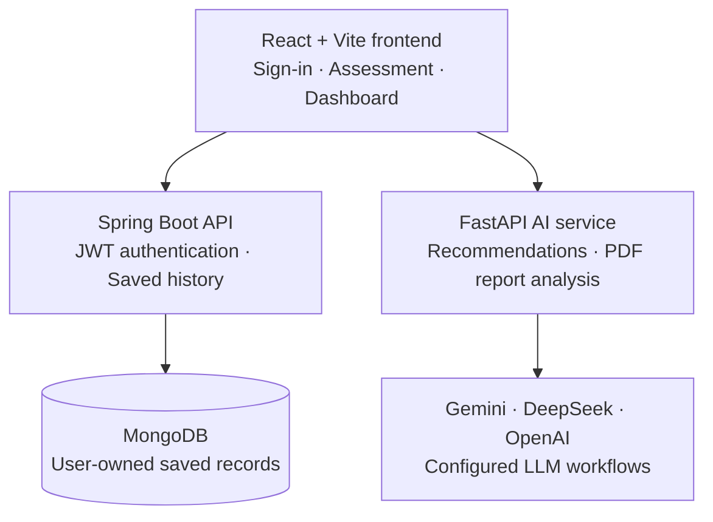

# HealthWise AI

> A full-stack health-intake and laboratory-insight platform that helps users complete a guided health assessment, receive AI-assisted test recommendations, analyse laboratory-report PDFs, and keep a secure personal history.


## What HealthWise AI does

- Guides users through a multi-stage health questionnaire.
- Reuses a signed-in user's saved Stage 1 baseline for future assessments.
- Generates structured, personalised laboratory-test recommendations.
- Extracts and interprets information from uploaded PDF laboratory reports.
- Stores questionnaires, recommendations, reports, and analyses in MongoDB.
- Provides an authenticated dashboard with saved history and interactive detail views.
- Uses JWT access tokens and refresh tokens to protect saved records.

> **Clinical disclaimer:** HealthWise AI is an informational support tool. It does not diagnose conditions, replace professional medical advice, or provide emergency care. Users should consult a qualified clinician for medical decisions.

## Architecture



## Repository layout

```text
Healthwise AI/
├── frontend_updated/          # React + Vite + Tailwind UI
├── healthwise-spring-backend/ # Java 21 / Spring Boot / MongoDB API
├── health-ai-backend/         # Python / FastAPI / LangChain AI API
└── tools/                     # Supporting project utilities
```

## Technology stack

| Area | Technology |
| --- | --- |
| Frontend | React 19, Vite, React Router, Tailwind CSS |
| Core API | Java 21, Spring Boot 3, Spring Security, JWT |
| Data | MongoDB, Spring Data MongoDB |
| AI API | Python, FastAPI, Pydantic, LangChain, LangGraph |
| AI models | Gemini 2.5 Flash Lite, DeepSeek V4 Flash, GPT-4o mini |
| Document analysis | PyMuPDF and PDF upload handling |

## Prerequisites

- Node.js 20+ and npm
- Java Development Kit (JDK) 21
- Python 3.11+
- MongoDB Community Server or a MongoDB Atlas cluster
- API keys for Gemini, DeepSeek, and OpenAI

## Quick start

Run all three services in separate terminals.

### 1. Start MongoDB

For a local instance, ensure MongoDB is running on port `27017`:

```text
mongodb://localhost:27017/healthwise
```

### 2. Start the Spring Boot API

```powershell
cd healthwise-spring-backend
$env:MONGODB_URI = "mongodb://localhost:27017/healthwise"
$env:JWT_SECRET = "replace-with-a-long-random-secret-of-at-least-32-characters"
./mvnw.cmd spring-boot:run
```

The API starts at `http://localhost:8080`.

### 3. Start the FastAPI AI service

Create `health-ai-backend/.env` locally. Do **not** commit it.

```dotenv
GOOGLE_API_KEY=your_google_ai_key
DEEPSEEK_API_KEY=your_deepseek_key
OPENAI_API_KEY=your_openai_key

GEMINI_MODEL=gemini-2.5-flash-lite
DEEPSEEK_MODEL=deepseek-v4-flash
OPENAI_MODEL=gpt-4o-mini

CORS_ORIGINS=["http://localhost:5173","http://127.0.0.1:5173"]
```

Then run:

```powershell
cd health-ai-backend
python -m venv .venv
.\.venv\Scripts\Activate.ps1
pip install -r requirements.txt
python -m uvicorn app.main:app --reload --port 8000
```

Health check: `http://localhost:8000/api/v1/health`

### 4. Start the frontend

Create `frontend_updated/.env.local`:

```dotenv
VITE_SPRING_API_URL=http://127.0.0.1:8080/api/v1
VITE_AI_API_URL=http://127.0.0.1:8000/api/v1
```

Then run:

```powershell
cd frontend_updated
npm install
npm run dev
```

Open `http://localhost:5173`.

## Environment variables

### Spring Boot API

| Variable | Required | Purpose |
| --- | --- | --- |
| `MONGODB_URI` | Yes | MongoDB connection URI |
| `JWT_SECRET` | Yes | Random secret, at least 32 characters |
| `JWT_ACCESS_TOKEN_MINUTES` | No | Access-token lifetime; default `60` |
| `JWT_REFRESH_TOKEN_DAYS` | No | Refresh-token lifetime; default `30` |
| `SERVER_PORT` | No | API port; default `8080` |
| `CORS_ORIGINS` | Yes in production | Comma-separated permitted frontend origins |

### FastAPI AI service

| Variable | Required | Purpose |
| --- | --- | --- |
| `GOOGLE_API_KEY` | Yes | Gemini provider key |
| `DEEPSEEK_API_KEY` | Yes | DeepSeek provider key |
| `OPENAI_API_KEY` | Yes | OpenAI provider key |
| `GEMINI_MODEL` | No | Default: `gemini-2.5-flash-lite` |
| `DEEPSEEK_MODEL` | No | Default: `deepseek-v4-flash` |
| `OPENAI_MODEL` | No | Default: `gpt-4o-mini` |
| `CORS_ORIGINS` | Yes in production | JSON list of permitted frontend origins |
| `REPORT_MAX_FILE_SIZE_BYTES` | No | PDF upload limit; default `20000000` |

### Frontend

| Variable | Required | Purpose |
| --- | --- | --- |
| `VITE_SPRING_API_URL` | Yes | Spring API URL ending in `/api/v1` |
| `VITE_AI_API_URL` | Yes | FastAPI URL ending in `/api/v1` |

**Never place private keys, database credentials, or JWT secrets in `VITE_*` variables.** Vite bundles these values into the browser application.

## Main API routes

### Spring Boot API — `/api/v1`

| Area | Routes |
| --- | --- |
| Authentication | `POST /auth/register`, `POST /auth/login`, `POST /auth/refresh`, `POST /auth/logout` |
| User | `GET /users/me`, `PUT /users/me`, `PUT /users/password` |
| Questionnaire | `POST /questionnaires`, `GET /questionnaires`, `GET /questionnaires/{id}` |
| Recommendations | `POST /recommendations`, `GET /recommendations`, `GET /recommendations/{id}` |
| Reports and analyses | `POST /reports`, `GET /reports`, `POST /analysis`, `GET /analysis` |
| Dashboard | `GET /dashboard` |

Authenticated requests require:

```http
Authorization: Bearer <access-token>
```

### FastAPI AI API — `/api/v1`

| Route | Purpose |
| --- | --- |
| `GET /health` | Lightweight service health check |
| `POST /recommendations` | Generate structured laboratory recommendations from a questionnaire |
| `POST /report-analysis` | Analyse a PDF report with the current questionnaire context |

## Development checks

```powershell
# Frontend production build
cd frontend_updated
npm run build

# Spring Boot package and tests
cd ../healthwise-spring-backend
./mvnw.cmd clean package

# FastAPI syntax/import compilation
cd ../health-ai-backend
python -m compileall app
```

## Deploying to AWS

Recommended first-production architecture:

| Component | AWS service |
| --- | --- |
| Frontend | AWS Amplify Hosting |
| Java API | AWS App Runner |
| FastAPI AI API | AWS App Runner |
| Secrets | AWS Secrets Manager |
| Container images | Amazon ECR |
| Database | MongoDB Atlas initially, or a separately validated AWS database migration |

For the production frontend, configure:

```dotenv
VITE_SPRING_API_URL=https://your-java-api.aws-region.awsapprunner.com/api/v1
VITE_AI_API_URL=https://your-ai-api.aws-region.awsapprunner.com/api/v1
```

Then update both backend CORS settings to the exact Amplify domain, such as:

```text
https://main.example.amplifyapp.com
```

Use AWS Secrets Manager for all database, JWT, and LLM-provider credentials. Do not store them in GitHub, Docker images, or frontend build variables.

## Security notes

- Keep the GitHub repository private while the project is in development.
- Rotate any secret immediately if it is ever committed or exposed in a screenshot.
- Use separate MongoDB users and databases for local, staging, and production environments.
- Restrict CORS to your actual frontend domain; never use `*` for authenticated APIs.
- Use HTTPS-only production URLs.
- Treat uploaded reports and generated outputs as sensitive health information.

## License

Add a license before publishing this project publicly. Until then, all rights are reserved by the project owner.

---

Built with React, Spring Boot, FastAPI, MongoDB, and configurable multi-model AI workflows.
