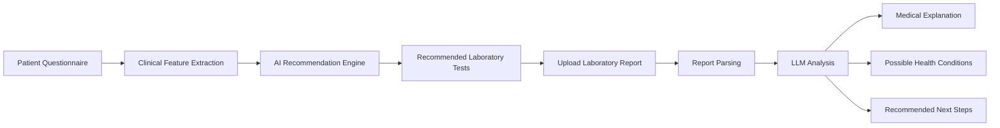

# 🩺 HealthWiseAI

> **AI-powered health assessment, diagnostic test recommendation, and medical report analysis platform.**

HealthWiseAI is a full-stack intelligent healthcare platform that assists users in identifying potential health conditions through a dynamic clinical questionnaire, recommends appropriate laboratory investigations, and provides AI-powered interpretation of uploaded medical reports.

The system combines Large Language Models (LLMs), knowledge-based reasoning, and modern web technologies to deliver personalized healthcare insights while maintaining an intuitive user experience.

---

## Features

- 🩺 Dynamic multi-stage clinical questionnaire
- 🤖 AI-powered diagnostic test recommendation
- 📄 Upload and analyze laboratory reports
- 🧠 LLM-generated explanations and health insights
- 📊 Structured report visualization
- 🔍 Retrieval-Augmented Generation (RAG) for medical knowledge
- 🌐 Knowledge graph support using Neo4j
- 🔐 Secure JWT authentication
- 📱 Modern responsive web interface

---

# System Architecture

```text
HealthWiseAI/
├── frontend/                     # React + TailwindCSS application
│   ├── src/
│   │   ├── components/
│   │   ├── pages/
│   │   ├── services/
│   │   ├── hooks/
│   │   └── App.tsx
│   └── package.json
│
├── backend/                      # Spring Boot API
│   ├── src/main/java/
│   │   ├── controller/
│   │   ├── service/
│   │   ├── repository/
│   │   ├── security/
│   │   ├── dto/
│   │   └── model/
│   └── pom.xml
│
├── ai-service/                   # FastAPI AI microservice
│   ├── api/
│   ├── recommendation/
│   ├── report_analysis/
│   ├── rag/
│   ├── llm/
│   └── requirements.txt
│
├── knowledge_graph/
│   └── Neo4j schema
│
└── storage/
    ├── uploaded_reports/
    └── processed_reports/
```

---

# How it works



---

# Core Capabilities

| Capability | Description |
|------------|-------------|
| Clinical Questionnaire | Collects patient symptoms, demographics, lifestyle factors, and medical history |
| AI Recommendation | Suggests appropriate laboratory investigations using clinical rules and AI reasoning |
| Medical Report Analysis | Extracts and interprets uploaded laboratory reports |
| RAG | Retrieves relevant medical knowledge to improve LLM responses |
| Knowledge Graph | Uses Neo4j to model diseases, symptoms, laboratory tests, and relationships |
| LLM Explanation | Generates understandable explanations for patients |
| Authentication | Secure JWT-based login and user management |

---

# Tech Stack

| Area | Technologies |
|------|--------------|
| Frontend | React, Vite, Tailwind CSS |
| Backend | Java Spring Boot |
| AI Service | FastAPI, Python |
| Database | MongoDB |
| Knowledge Graph | Neo4j |
| Authentication | Spring Security, JWT |
| AI | Large Language Models (LLMs) |
| Retrieval | RAG |
| Deployment | Docker (planned) |

---

# Main Workflow

### Stage 1

Patient Profile

- Age
- Sex
- Height
- Weight
- Lifestyle

↓

### Stage 2

Medical History

↓

### Stage 3

Symptoms

↓

### Stage 4

Clinical Summary

↓

### Stage 5

AI Recommendation

↓

### Stage 6

Recommended Laboratory Tests

↓

### Stage 7

Upload Medical Report

↓

### Stage 8

AI Report Analysis

↓

### Stage 9

Health Insights

---

# Key Features

## Dynamic Clinical Questionnaire

The questionnaire adapts according to patient responses, collecting relevant medical information while minimizing unnecessary questions.

---

## AI Test Recommendation

Based on patient information, the recommendation engine suggests suitable diagnostic laboratory investigations such as:

- Complete Blood Count (CBC)
- Lipid Profile
- Liver Function Test
- Kidney Function Test
- HbA1c
- Thyroid Function Test
- Vitamin Deficiency Tests
- and many others.

---

## Medical Report Analysis

Users can upload laboratory reports for AI-assisted interpretation.

The system:

- extracts report information,
- explains abnormal values,
- summarizes findings,
- highlights potential concerns,
- recommends follow-up actions.

---

## Retrieval-Augmented Generation

HealthWiseAI augments LLM responses using medical knowledge retrieval to improve factual grounding and reduce hallucinations.

---

## Knowledge Graph

Neo4j models relationships between:

- Diseases
- Symptoms
- Laboratory Tests
- Risk Factors

allowing intelligent reasoning and recommendation.

---

# Future Improvements

- Physician dashboard
- Patient history tracking
- Medical image analysis
- Appointment scheduling
- Electronic Health Record integration
- Multi-language support
- Wearable device integration

---

# Technologies Used

### Frontend

- React
- Tailwind CSS
- Axios
- Vite

### Backend

- Java
- Spring Boot
- Spring Security
- JWT

### AI

- FastAPI
- Python
- LLMs
- Retrieval-Augmented Generation (RAG)

### Databases

- MongoDB
- Neo4j

### Tools

- Docker
- Git
- Maven

---

# License

This project was developed for academic and research purposes.

---

**HealthWiseAI empowers intelligent healthcare by combining clinical reasoning, knowledge graphs, and Large Language Models into a unified diagnostic support platform.**
