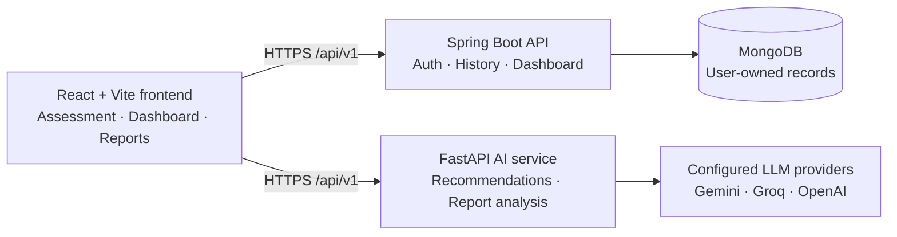
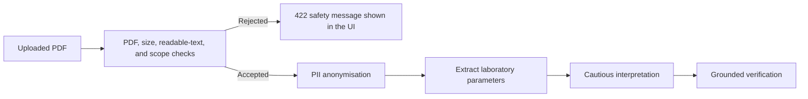

# HealthWise AI

> **Personalised health insights, designed to make the next conversation more informed.**

HealthWise AI is a full-stack health-intake and laboratory-report insight platform. It guides a user through a structured health assessment, generates evidence-aware laboratory-test recommendations, analyses uploaded laboratory-report PDFs, and keeps the user’s history in a secure authenticated workspace.

> **Important:** HealthWise AI is an informational support tool. It does not diagnose conditions, prescribe treatment, replace professional medical advice, or provide emergency care.


## Why HealthWise AI?

Health information can feel fragmented: symptoms live in one place, laboratory reports in another, and useful questions are often discovered too late. HealthWise AI brings those inputs into one clear workflow so users can:

- build a reusable personal health baseline;
- receive structured, non-diagnostic laboratory-test suggestions;
- upload a laboratory diagnostic-report PDF for a grounded summary;
- revisit saved recommendations, reports, analyses, and recent activity from one dashboard;
- prepare for more productive discussions with qualified healthcare professionals.

## Key features

| Area | Capability |
| --- | --- |
| Guided assessment | Multi-stage health, lifestyle, medical-history, and symptom intake flow. Stage 1 is retained in-session and can be pre-filled from the user’s latest saved baseline. |
| AI recommendations | A multi-stage evaluator → critic → optimiser workflow produces structured laboratory-test recommendations with clear rationales. |
| Laboratory-report analysis | Upload a text-readable PDF laboratory report and receive a grounded summary of reported parameters, abnormal findings, and follow-up context. |
| Safety controls | Non-laboratory PDFs, unreadable documents, and obvious prompt-injection text are rejected before any LLM processing. |
| Private history | MongoDB stores user-owned questionnaires, recommendations, uploaded-report metadata, analyses, and timeline events. |
| Personal dashboard | Shows a personalised welcome, recent activity, saved history, counts, and interactive record-detail dialogs. |
| Authentication | JWT access and refresh tokens protect user records, with automatic sign-out after prolonged inactivity. |

## Architecture



### Report-analysis safety path



## Repository layout

```text
HealthWise AI/
├── frontend_updated/          # React + Vite client application
├── healthwise-spring-backend/ # Java 21 / Spring Boot / MongoDB API
├── health-ai-backend/         # Python / FastAPI / LangGraph AI API
├── tools/                     # Supporting project utilities
├── .gitignore
└── README.md
```

## Technology stack

| Layer | Technologies |
| --- | --- |
| Frontend | React 19, Vite, React Router, Tailwind CSS |
| Core API | Java 21, Spring Boot 3, Spring Security, JWT |
| Data | MongoDB, Spring Data MongoDB |
| AI service | Python, FastAPI, Pydantic, LangChain, LangGraph |
| Document processing | PyMuPDF, Presidio Analyzer/Anonymizer, spaCy |
| Model providers | Google Gemini, Groq, OpenAI; optional DeepSeek configuration |
| Containers | Docker, Caddy for frontend production serving |

## Quick start

### Prerequisites

- Node.js 20+ and npm
- JDK 21 and Maven 3.9+
- Python 3.11+
- MongoDB Community Server or MongoDB Atlas
- Provider API keys for the LLM stages you enable

Run the database and each service in its own terminal.

### 1. Start MongoDB

For local development, start MongoDB with a database named `healthwise`:

```text
mongodb://localhost:27017/healthwise
```

### 2. Start the Spring Boot API

```powershell
cd healthwise-spring-backend
$env:MONGODB_URI = "mongodb://localhost:27017/healthwise"
$env:JWT_SECRET = "replace-with-a-long-random-secret-of-at-least-32-characters"
mvn spring-boot:run
```

The core API starts at `http://localhost:8080`.

### 3. Start the FastAPI AI service

Create `health-ai-backend/.env` locally. Never commit this file.

```dotenv
GOOGLE_API_KEY=your_google_ai_key
GROQ_API_KEY=your_groq_key
OPENAI_API_KEY=your_openai_key

GEMINI_MODEL=gemini-2.5-flash-lite
GROQ_MODEL=openai/gpt-oss-20b
OPENAI_MODEL=gpt-4o-mini

CORS_ORIGINS=["http://localhost:5173","http://127.0.0.1:5173"]
```

Then install and start the service:

```powershell
cd health-ai-backend
python -m venv .venv
.\.venv\Scripts\Activate.ps1
pip install -r requirements.txt
python -m uvicorn app.main:app --reload --port 8000
```

Health check: `http://localhost:8000/api/v1/health`

### 4. Start the frontend

Create `frontend_updated/.env.local`:

```dotenv
VITE_SPRING_API_URL=http://127.0.0.1:8080/api/v1
VITE_AI_API_URL=http://127.0.0.1:8000/api/v1
```

Then run:

```powershell
cd frontend_updated
npm install
npm run dev
```

Open `http://localhost:5173`.

## Configuration

### Spring Boot API

| Variable | Required | Description |
| --- | --- | --- |
| `MONGODB_URI` | Yes | MongoDB connection URI. |
| `SPRING_DATA_MONGODB_DATABASE` | Production | Database name, for example `healthwise`. |
| `JWT_SECRET` | Yes | Random secret of at least 32 characters. |
| `JWT_ACCESS_TOKEN_MINUTES` | No | Access-token lifetime; default `60`. |
| `JWT_REFRESH_TOKEN_DAYS` | No | Refresh-token lifetime; default `30`. |
| `PORT` / `SERVER_PORT` | No | Runtime port; defaults to `8080`. Railway supplies `PORT`. |
| `CORS_ORIGINS` | Production | Comma-separated frontend origins; no trailing slash. |

Example:

```text
CORS_ORIGINS=http://localhost:5173,http://127.0.0.1:5173,https://your-frontend.up.railway.app
```

### FastAPI AI service

| Variable | Required | Description |
| --- | --- | --- |
| `GOOGLE_API_KEY` | Yes for current evaluator/interpreter stages | Gemini API key. |
| `GROQ_API_KEY` | Yes for current critic stage | Groq API key. |
| `OPENAI_API_KEY` | Yes for current optimiser/verifier stages | OpenAI API key. |
| `GEMINI_MODEL` | No | Default: `gemini-2.5-flash-lite`. |
| `GROQ_MODEL` | Yes for current Groq critic stage | Set explicitly to `openai/gpt-oss-20b`. |
| `OPENAI_MODEL` | No | Default: `gpt-4o-mini`. |
| `DEEPSEEK_API_KEY` / `DEEPSEEK_MODEL` | No | Reserved optional provider configuration. |
| `CORS_ORIGINS` | Production | JSON array of allowed frontend origins. |
| `REPORT_MAX_FILE_SIZE_BYTES` | No | PDF size limit; default `20000000` (20 MB). |
| `REPORT_UPLOAD_CHUNK_SIZE_BYTES` | No | Upload streaming chunk size. |

FastAPI CORS must be valid JSON:

```text
CORS_ORIGINS=["https://your-frontend.up.railway.app"]
```

### Frontend

| Variable | Required | Description |
| --- | --- | --- |
| `VITE_SPRING_API_URL` | Yes | Public Spring API URL ending in `/api/v1`. |
| `VITE_AI_API_URL` | Yes | Public FastAPI URL ending in `/api/v1`. |

> `VITE_*` values are embedded in the browser bundle at build time. Never put API keys, database credentials, or JWT secrets in them.

## API overview

### Spring Boot API — `/api/v1`

| Area | Main routes |
| --- | --- |
| Authentication | `POST /auth/register`, `POST /auth/login`, `POST /auth/refresh`, `POST /auth/logout` |
| Profile | `GET /users/me`, `PUT /users/me`, `PUT /users/password`, `DELETE /users/me` |
| Questionnaire history | `POST /questionnaires`, `GET /questionnaires`, `GET /questionnaires/{id}` |
| Recommendation history | `POST /recommendations`, `GET /recommendations`, `GET /recommendations/{id}`, `DELETE /recommendations/{id}` |
| Reports | `POST /reports`, `GET /reports`, `GET /reports/{id}`, `DELETE /reports/{id}` |
| Saved analyses | `POST /analysis`, `GET /analysis`, `GET /analysis/{id}` |
| Dashboard | `GET /dashboard` — includes the authenticated user’s `firstName` and saved-history projection |

Protected routes require:

```http
Authorization: Bearer <access-token>
```

### FastAPI AI API — `/api/v1`

| Route | Purpose |
| --- | --- |
| `GET /health` | Lightweight liveness check; does not call an LLM. |
| `POST /recommendations` | Returns structured, non-diagnostic laboratory-test recommendations for a validated questionnaire. |
| `POST /report-analysis` | Analyses an eligible laboratory diagnostic-report PDF using the current questionnaire only as context. |

Invalid or unsafe report uploads receive an actionable `422` response, for example:

```text
Safety check: HealthWise AI can analyse only laboratory diagnostic-report PDFs with test results or reference ranges.
```

## Run checks

```powershell
# Frontend production build
cd frontend_updated
npm run build

# Spring Boot package
cd ../healthwise-spring-backend
mvn -DskipTests package

# FastAPI safety tests and compilation
cd ../health-ai-backend
python -m unittest discover -s tests -v
python -m compileall app
```

## Production deployment with Railway

The repository includes production Dockerfiles and `.dockerignore` files for all three services.

### Create four Railway services

| Service | Root directory | Public? |
| --- | --- | --- |
| MongoDB | Railway MongoDB service | **No** — private networking only |
| `spring-api` | `/healthwise-spring-backend` | Yes, target port `8080` |
| `ai-api` | `/health-ai-backend` | Yes, target port `8080` |
| `health-frontend` | `/frontend_updated` | Yes, target port `8080` |

### Essential Railway variables

**`spring-api`**

```text
MONGODB_URI=${{MongoDB.MONGO_URL}}
SPRING_DATA_MONGODB_DATABASE=healthwise
JWT_SECRET=<long-random-secret>
CORS_ORIGINS=https://your-frontend.up.railway.app
```

**`ai-api`**

```text
GOOGLE_API_KEY=<secret>
GROQ_API_KEY=<secret>
OPENAI_API_KEY=<secret>
GROQ_MODEL=openai/gpt-oss-20b
CORS_ORIGINS=["https://your-frontend.up.railway.app"]
```

**`health-frontend`**

```text
VITE_SPRING_API_URL=https://your-spring-api.up.railway.app/api/v1
VITE_AI_API_URL=https://your-ai-api.up.railway.app/api/v1
```

The frontend variables are build-time values. After changing either one, trigger a fresh frontend build and deployment.

Use Railway private networking only between Railway services. The browser must use the public `https://...up.railway.app` domains; it cannot reach `*.railway.internal` addresses.

## Security and privacy practices

- Never commit `.env` files, provider keys, JWT secrets, or MongoDB credentials.
- Restrict CORS to exact frontend origins; do not use `*` on authenticated APIs.
- Keep MongoDB private; connect it through Railway’s internal `MONGO_URL` reference.
- Use HTTPS public domains in production.
- Treat health data and generated insights as sensitive information.
- The report-analysis service validates the PDF format, file size, readable text, laboratory-report evidence, and obvious prompt-injection content before LLM processing.
- Rotate a secret immediately if it is exposed in Git history, logs, screenshots, or a shared environment.

## Contributing

1. Create a branch from `main`.
2. Keep secrets out of commits.
3. Run the relevant checks above.
4. Open a pull request describing the behaviour change and verification performed.

## License

Add a licence before publishing the repository publicly. Until then, all rights are reserved by the project owner.

---

Built with React, Spring Boot, FastAPI, MongoDB, and safety-focused multi-model AI workflows.
